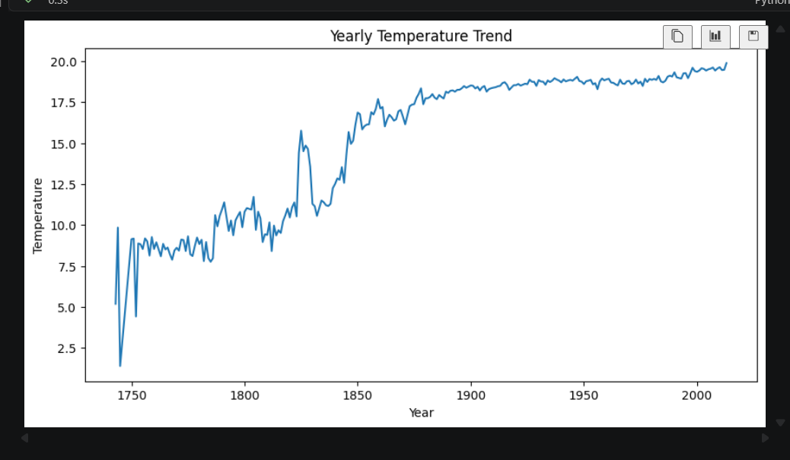
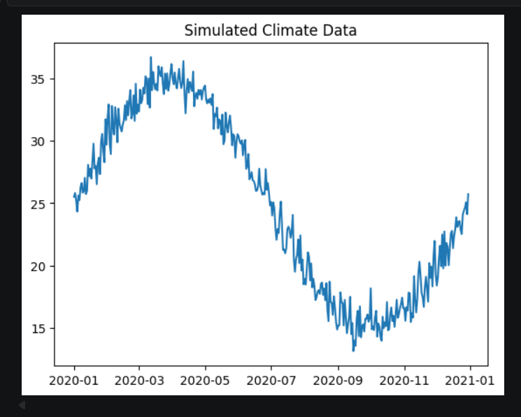

## 🌍 Climate Trend Analyzer

---

## 📌 Project Overview

The Climate Trend Analyzer is a data science project that analyzes historical climate data to identify patterns, detect anomalies, and predict future temperature trends using machine learning techniques.

This project simulates real-world climate analysis systems used by environmental researchers and policy-makers.

---

## ❗ Problem Statement

Climate data is vast and complex, making it difficult to:

- Identify long-term temperature trends
- Detect abnormal climate events
- Understand seasonal variations
- Predict future climate behavior

This project addresses these challenges using data analysis and machine learning.

---

## 🌍 Industry Relevance

This type of system is widely used in:

- Climate research organizations
- Government environmental agencies
- Smart city planning
- Agriculture and weather forecasting
- Disaster management systems

---

## 💼 Business / Research Value

- Helps in understanding climate change trends
- Assists in environmental decision-making
- Enables prediction of future climate risks
- Supports sustainability and planning initiatives

---

## 🛠 Tech Stack

- Python
- Pandas
- NumPy
- Matplotlib
- Seaborn
- Scikit-learn
- Jupyter Notebook

---

## 🏗️ Project Architecture

Data Collection → Preprocessing → Analysis → Visualization → Anomaly Detection → Forecasting → Insights

---

```

## 📁 Folder Structure

Climate-Trend-Analyzer/
│
├── data/
│   ├── raw/
│   │   └── GlobalLandTemperaturesByCountry.csv
│   └── processed/
│
├── notebooks/
│   └── eda.ipynb
│
├── src/
│   ├── data_loader.py
│   ├── preprocessing.py
│   ├── analysis.py
│   ├── visualization.py
│   ├── anomaly_detection.py
│   └── model.py
│
├── outputs/
│   ├── graphs/
│   │   ├── 01_temperature_trend.png
│   │   ├── 02_temperature_trend_seaborn.png
│   │   ├── 03_temperature_distribution.png
│   │   ├── 04_country_wise_trend.png
│   │   ├── 05_smoothed_trend.png
│   │   ├── 06_monthly_variation.png
│   │   ├── 07_anomaly_detection.png
│   │   ├── 08_future_prediction.png
│   │
│   └── reports/
│       └── summary.txt
│
├── app/
│   └── streamlit_app.py
│
├── models/
│   └── trained_model.pkl
│
├── docs/
│   └── project_workflow.md
│
├── requirements.txt
├── README.md
├── .gitignore
└── main.py

```

---

## ⚙️ Installation Steps

1. Clone the repository

git clone https://github.com/keshkarsaloni-lab/Climate-Trend-Analyzer.git
cd climate-trend-analyzer

2. Create virtual environment

python -m venv venv
venv\Scripts\activate   # Windows

3. Install dependencies

pip install -r requirements.txt

---

## 📊 Dataset Details

- Source: Kaggle Climate Dataset
- File Used: "GlobalLandTemperaturesByCountry.csv"
- Data includes:
  - Date
  - Temperature
  - Country

---

## ▶️ How to Run

Run Notebook

jupyter notebook

Open:

notebooks/eda.ipynb

OR run Python script

python main.py

---

## 🔬 Simulation Workflow

1. Load real-world climate dataset
2. Clean and preprocess data
3. Extract time-based features (year, month)
4. Perform trend analysis
5. Detect anomalies using statistical methods
6. Simulate climate patterns using time-series logic
7. Predict future temperature using regression model
8. Generate visual insights

---

## 📈 Results

- Temperature shows a gradual increasing trend
- Seasonal variations observed across months
- Anomalies detected in extreme years
- Future prediction indicates rising temperature

---

## 📸 Screenshots

### 📈 Temperature Trend


### 📊 Seaborn Trend Visualization


### 📉 Temperature Distribution


### 🌍 Country-wise Analysis


### 🚨 Anomaly Detection


### 🔮 Future Prediction


### 📋 Yearly Summary


### 🔥 Correlation Heatmap


### 🧪 Simulated Data


---

## 🚀 Future Improvements

- Add ARIMA / LSTM for advanced forecasting
- Build interactive dashboard using Streamlit
- Add rainfall and humidity analysis
- Integrate real-time API data

---

## 📚 Learning Outcomes

- Time-series data analysis
- Data preprocessing techniques
- Visualization skills
- Anomaly detection methods
- Machine learning for forecasting
- Real-world project structuring

---

## ⭐ Conclusion

This project demonstrates how data science techniques can be used to analyze climate trends, detect anomalies, and predict future environmental patterns, making it highly relevant for real-world applications.

---
## 👩‍💻 Author

Saloni Keshkar

---